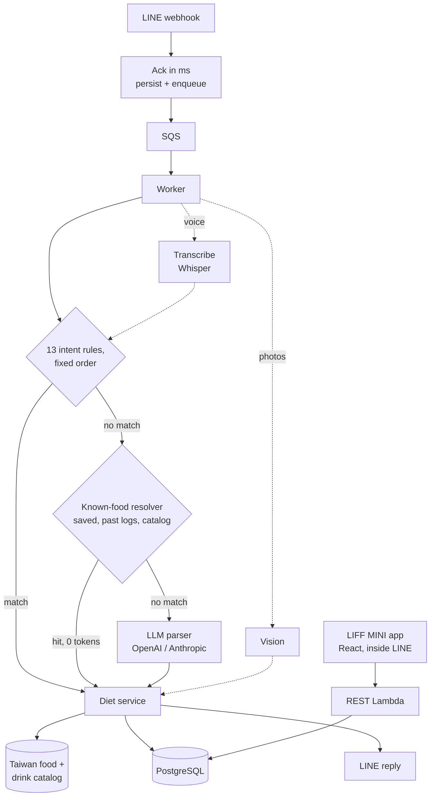

# FitNeko — Engineering Case Study

FitNeko is a LINE-first AI fitness coach, built solo: chat naturally — Chinese, English, or photos — to log meals and workouts; a React MINI app inside LINE handles the review-heavy rest.

> 🚧 **Living case study of an actively developed product.** The source is private; this repo documents the architecture and the decisions. Details live in the [devlog](devlog/) and [deep dives](#deep-dives).

```
User: 早餐吃了一個鮭魚御飯團跟大杯拿鐵
Bot:  已記錄 🍙 鮭魚御飯團 ×1 (220 kcal) ☕ 大杯拿鐵 ×1 (180 kcal)
      今日累計 400 / 1800 kcal，蛋白質 18 / 120 g
```

## What it does

- **Natural-language logging** — free-form zh-TW / English / mixed text becomes structured calorie + macro logs.
- **Photo intake** — meal photos get portion estimates; nutrition labels get OCR'd, then the bot asks how much you ate.
- **Voice logging** — send a LINE voice message and it's transcribed (OpenAI Whisper), then flows through the exact same parsing as typed text; over-long clips are declined up front.
- **Conversational corrections** — `把早餐的蛋改成兩顆` / `delete the latte from lunch`, targeted at any past entry.
- **TDEE-assisted goals** — one message computes personal targets; missing fields are asked one at a time, then confirmed.
- **Workouts & guided strength sessions** — MET-based burn estimates; mid-workout, a set is logged by typing `10x70`.
- **Taiwan food catalog** — 2,500+ items with source-tracked official nutrition; exact hits beat LLM guesses, unknowns still estimate.
- **Zero-token fast path** — common foods, your saved foods, and your own past corrections resolve straight to a log with no LLM call at all; the model is spent only on genuinely new input, and a mis-read safely falls back rather than logging the wrong food.
- **Hand-shaken drinks, decomposed** — brand × base × sugar level × toppings × cup size, costed by a deterministic engine; sugar is a first-class field.
- **A MINI app for review-heavy tasks** — dashboard, editable history, training-plan editor, trends, settings; same LINE identity, bilingual, animated mascot.
- **Cost guardrails** — daily free credits for image vision, confirm-before-spend on permanent credits, every movement ledgered.
- Plus: personal saved foods, weight tracking, daily summaries, in-chat help.

## System at a glance



<sub>Known foods resolve before the LLM at zero cost; catalog beats estimator; unknowns still estimate. A credit guard meters the vision path. Full detail in the [deep dives](#deep-dives).</sub>

**Stack:** Go · PostgreSQL / Neon · LINE Messaging API + LIFF · React + TypeScript + Vite · OpenAI + Anthropic APIs · AWS Lambda + SQS + API Gateway (Terraform) · DynamoDB · GitHub Actions CI/CD (OIDC, zero stored keys) · Playwright

**Scale:** ~24.2k LOC application Go · ~6.4k LOC TypeScript/React · ~25.5k LOC Go tests (130 files) · 30 migrations · 677 commits

## Deep dives

The interesting engineering lives in seven decisions:

| # | Deep dive | The one-line takeaway |
|---|-----------|----------------------|
| 1 | [Async intake: acknowledge fast, reply later](deep-dives/01-async-intake-pipeline.md) | LINE webhooks can't wait for an LLM — enqueue, return 200, treat the reply token as perishable. |
| 2 | [Deterministic parsing before the LLM](deep-dives/02-deterministic-parsing-before-llm.md) | 13 ordered rules resolve sure-fire intents with zero latency, zero cost, zero hallucination. |
| 3 | [One interface, two LLM providers](deep-dives/03-llm-provider-abstraction.md) | OpenAI and Anthropic force structure differently; unifying them shaped the parsing layer. |
| 4 | [Clarification flows: when the bot asks back](deep-dives/04-clarification-flows.md) | Multi-turn state in a stateless webhook world, TTL-bounded and gracefully degrading. |
| 5 | [Testing across a migration you haven't done yet](deep-dives/05-migration-proof-e2e.md) | One e2e suite ran unchanged before and after the serverless migration — guarding it, not rewritten by it. |
| 6 | [History is fact, a plan is a template](deep-dives/06-history-vs-template.md) | An autosave was silently erasing training history; the fix was classifying every row as fact or template. |
| 7 | [The cheapest LLM call is the one you never make](deep-dives/07-known-food-passthrough.md) | Known foods resolve before the model at zero cost, gated by a whitelist so a mis-read falls back instead of logging wrong data. |

## Engineering practices

- **Spec-first phases** — every phase starts from a written spec with numbered requirements and explicit error cases (~24 phases so far).
- **TDD against behavior** — tests assert on replies sent and rows written, never internals; a one-command e2e harness (deterministic mock tier + LLM-judged real tier) survived the serverless migration unchanged.
- **CI on every push** — Go + web suites, mock-tier e2e, Lambda smoke builds, Playwright browser e2e, and a backup-restore proof; ~3 minutes, zero real credentials.
- **CD with zero stored keys** — every merge auto-deploys a dev environment via GitHub OIDC; prod is a two-step plan-then-apply, every deploy tagged.
- **Migrations as code** — versioned up/down SQL pairs, applied idempotently by the pipeline.
- **Graceful degradation by default** — LLM retries with backoff, clarification failures re-prompt, unreadable images never fabricate a log.

## Devlog

One entry per completed phase — problem, decisions, honest hindsight: **[devlog/](devlog/)**

## What this repo is not

Not the product source, not runnable. Prompt designs, full intent-rule conditions, and nutrition estimation rules stay private; code excerpts are architecture-level.

---

*ZihYong (Jeffery) Huang — [github.com/jeffery12697](https://github.com/jeffery12697)*
