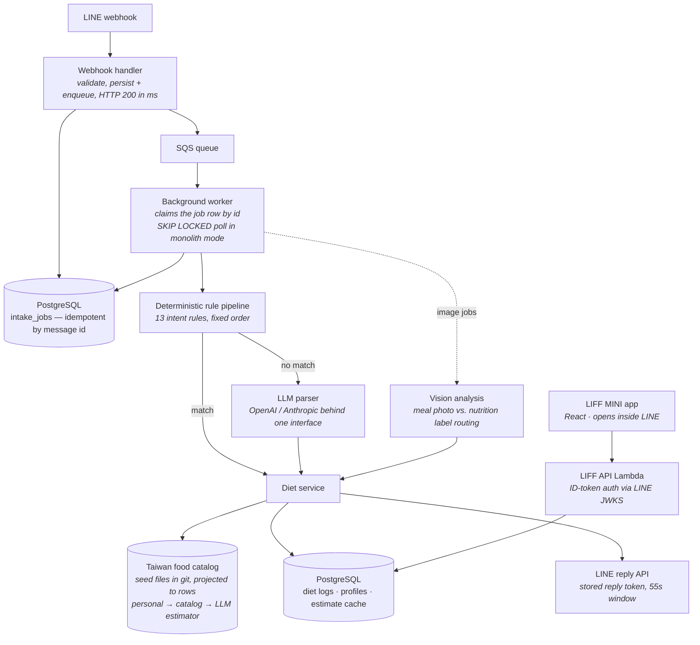

# FitNeko — Engineering Case Study

FitNeko is a LINE-first AI fitness product I'm building solo — a Go backend and, since phase 22, a React MINI app that opens inside the chat. Users chat naturally — text or photos, in Chinese, English, or mixed — to log meals and workouts, track weight, and run guided strength sessions, with calorie/macro tracking against personal TDEE-based targets; the review-and-edit surfaces chat is bad at (history browsing, plan editing, trends, settings) live in the LIFF app, all inside LINE.

> 🚧 **This is a living case study of an actively developed product.** The product source is private; this repo documents the architecture, the engineering decisions, and what I learned building it. Updated at the end of each development phase — see the [devlog](devlog/).

```
User: 早餐吃了一個鮭魚御飯團跟大杯拿鐵
Bot:  已記錄 🍙 鮭魚御飯團 ×1 (220 kcal) ☕ 大杯拿鐵 ×1 (180 kcal)
      今日累計 400 / 1800 kcal，蛋白質 18 / 120 g
```

## What it does

- **Natural-language food logging** — free-form text in zh-TW, English, or mixed, parsed into structured logs (calories, protein, carbs, fat).
- **Photo intake** — meal photos get portion estimation; nutrition-label photos get per-serving OCR, then the bot asks *"how much did you actually eat?"* (`1份`, `30g`, `半包`, `2 servings`) before logging.
- **Conversational corrections** — `把早餐的蛋改成兩顆`, `delete the latte from lunch`, targeted at history, not just the latest entry. Chinese hits the deterministic rule layer; English routes through the LLM parser to the same intents, replying in kind.
- **TDEE-assisted goals** — `幫我算目標 我175cm 70kg 30歲男 久坐 想減脂` computes Mifflin-St Jeor targets, asks for missing fields one at a time, and confirms before writing.
- **Workout logging with net intake** — `跑步30分鐘` gets a MET-based burn estimate; the daily summary shows intake minus burn (while target comparison deliberately stays gross — the TDEE targets already price in activity).
- **Guided strength sessions** — a seeded training plan drives `今天練什麼` / `what should I train today` menus with last session's numbers and double-progression suggestions; mid-workout, a set is logged by typing just `10x70`, and `next` / `skip` / `end` steer the session in either language.
- **Taiwan food catalog** — 2,500+ items of official-grade nutrition (government dataset + convenience-store disclosures, every row carrying its source URL and capture date). An exact name/alias hit beats the LLM estimate — for meal photos, the vision model's gram-weight estimate × per-100g density replaces pixel guessing — and unknown foods still fall through to estimation.
- **A MINI app for the review-heavy tasks** — a LIFF web app on the same LINE identity (no second login): dashboard with calorie ring and macro bars, paged food/workout history with inline edits, a three-level training-plan editor with drag reordering, trend charts, and settings. Bilingual, mock-backed offline dev mode, and browser e2e against the real stack.
- **Personal saved foods, weight tracking, daily summaries, in-chat help.**

## System at a glance



**Stack:** Go · PostgreSQL / Neon · LINE Messaging API + LIFF · React + TypeScript + Vite (MINI app) · OpenAI Responses API · Anthropic Messages API · Docker Compose (local) · DynamoDB (serverless clarification store) · AWS Lambda + SQS behind API Gateway, provisioned with Terraform (prod + disposable dev workspaces) · GitHub Actions CI/CD (OIDC, zero stored cloud keys) · Playwright browser e2e

**Scale of the codebase:** ~19.8k LOC of application Go (including a ~1.9k-LOC end-to-end test harness) plus ~5.6k LOC of TypeScript/React, ~19.7k LOC of Go tests across 85 test files, 20 SQL migrations, 500+ commits.

## Deep dives

The interesting engineering lives in six decisions:

| # | Deep dive | The one-line takeaway |
|---|-----------|----------------------|
| 1 | [Async intake: acknowledge fast, reply later](deep-dives/01-async-intake-pipeline.md) | LINE webhooks can't wait for an LLM. Enqueue, return 200, and treat the reply token as a perishable resource. |
| 2 | [Deterministic parsing before the LLM](deep-dives/02-deterministic-parsing-before-llm.md) | Knowing when *not* to use an LLM. 13 ordered rules resolve sure-fire intents with zero latency, zero cost, zero hallucination. |
| 3 | [One interface, two LLM providers](deep-dives/03-llm-provider-abstraction.md) | OpenAI structured outputs and Anthropic tool-use forcing behave differently; unifying them shaped the whole parsing layer. |
| 4 | [Clarification flows: when the bot asks back](deep-dives/04-clarification-flows.md) | Multi-turn state in a stateless webhook world — TTL-bounded pending questions that degrade gracefully. |
| 5 | [Testing across a migration you haven't done yet](deep-dives/05-migration-proof-e2e.md) | A suite built to run unchanged before and after a serverless migration — so it guards the move instead of being rewritten by it. |
| 6 | [History is fact, a plan is a template](deep-dives/06-history-vs-template.md) | The plan editor's autosave was silently erasing training history. The fix wasn't a cleverer foreign key — it was classifying every row as fact or template. |

## Engineering practices

- **Spec-first phases.** Every feature phase starts with a written spec (numbered requirements, explicit error cases) before any code — since phase 18, always including a semantic-boundary matrix with positive *and* negative test cases for every ambiguity ruling. Development history is a sequence of ~23 phases so far.
- **TDD throughout.** Tests are written against behavior: unit tests for parser rules, DB-backed integration tests gated on `TEST_DATABASE_URL`, and end-to-end worker tests that assert on *results and persisted data* — reply text sent, diet log rows created — never on internal state like cache hits or rule order. As of phase 17e this is a one-command harness with a deterministic mock tier and an LLM-judged real tier, built behind a driver seam so the same scenarios ran unchanged across the serverless migration (phases 17b–17f: the canonical Lambda + RDS stack, then a cost-optimized rewrite to Neon, then the worker moved off Fargate back to an SQS-triggered Lambda) — guarding the move rather than being rewritten by it.
- **CI on every push.** GitHub Actions runs vet, unit tests against a real Postgres, the deterministic mock-tier e2e suite, a smoke build of every Lambda artifact, the frontend's unit tests and typed build, and a Playwright browser e2e job that drives Chromium through the real Vite app into the real API and database with a fresh user per run — no real credentials, no LLM tokens, ~3 minutes wall-clock across parallel jobs. The database-backup restore path is part of the unit suite, so "backups are restorable" is re-proven on every push.
- **Migrations as code.** Versioned up/down SQL pairs, applied idempotently and tracked in a `schema_migrations` table; the pipeline runs them after every deploy via a dedicated `migrate` command.
- **CD with zero stored keys.** Every merge to `main` auto-deploys an always-on dev environment against real AWS (apply, migrate, smoke test) via GitHub OIDC — no long-lived cloud credentials anywhere. Production is a two-step dispatch: publish the plan, read it, then apply that exact saved plan; every prod deploy leaves a `prod-<timestamp>` tag.
- **Graceful degradation as a default.** LLM calls retry with exponential backoff and honor `Retry-After`; clarification-store failures degrade to a re-prompt instead of an error; unreadable images get a safe reply instead of a bogus log.

## Devlog

Ongoing, one entry per completed phase: **[devlog/](devlog/)**

## What this repo is not

This is not the product source and it is not runnable. Prompt designs, full intent-rule conditions, and nutrition estimation rules are deliberately not included. Code excerpts here are architecture-level (interfaces, orchestration logic) and lightly trimmed for readability.

---

*ZihYong (Jeffery) Huang — [github.com/jeffery12697](https://github.com/jeffery12697)*
