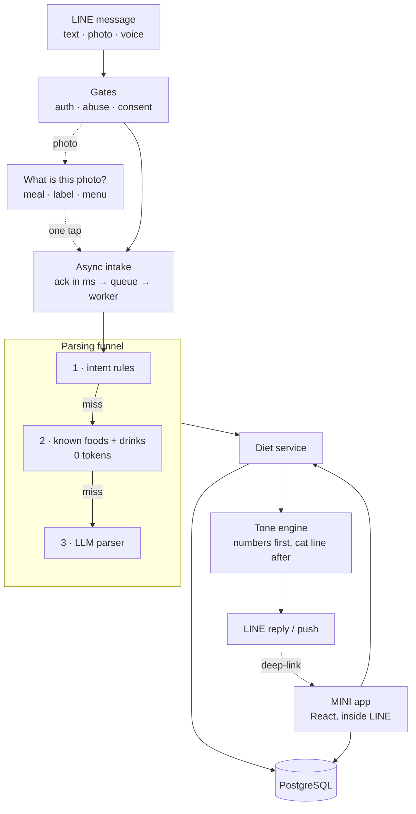

# FitNeko: Engineering Case Study

FitNeko is an AI fitness coach that lives in LINE. You log meals and workouts by chatting in Chinese or English, or by sending a photo; a React MINI app inside LINE covers the parts chat is bad at. I built it alone.

**Live:** [fitneko.app](https://fitneko.app). The bot, the MINI app and the marketing site are all in production.

> This is a living case study of a product still under development. The source is private; this repo documents the architecture and the decisions, in the [devlog](devlog/) and the [deep dives](#deep-dives).

```
User: 早餐吃了一個鮭魚御飯團跟大杯拿鐵
Bot:  已記錄 🍙 鮭魚御飯團 ×1 (220 kcal) ☕ 大杯拿鐵 ×1 (180 kcal)
      今日累計 400 / 1800 kcal，蛋白質 18 / 120 g
```

## See it

<p align="center">
  
  
  
  
</p>

<sub>Log it in chat, review it in the MINI app, one LINE identity across both. More captures, each captioned with the engineering behind it, plus a 16-second clip of the whole loop, in [demo/](demo/).</sub>

## What it does

**Log by talking.**
- Free-form zh-TW, English or mixed text becomes a structured calorie + macro log.
- Send a photo and the bot asks once whether it is a meal, a nutrition label or a menu, before it spends anything.
- Voice notes feed the same parser. Corrections are plain language: 「把早餐的蛋改成兩顆」 edits the entry it names.

**Know the food.**
- A 3,200+ item Taiwan catalog from government nutrition data and chains' official figures. An exact hit always beats an LLM guess.
- The calories in a hand-shaken drink come from a formula over brand × base × sugar × toppings × cup size, covering eight chains.
- Known foods, saved foods and branded drink orders resolve with zero LLM tokens. The model only sees input nothing else recognized.

**Coach on top of the numbers.**
- TDEE-assisted goals, MET-based workouts, guided strength sessions (`10x70` logs a set), six curated programs in one tap.
- Daily "what should I eat?" from the *remaining* budget; a weekly report card of stats plus LLM commentary.
- Streaks pay out credits, and credits can repair a broken streak. A repaired day is marked as such and never counts toward achievements.
- Invites reward both sides, capped monthly so a leaked code isn't worth farming; milestone stickers keep the loop alive past the cap.

**Meet the cat.**
- Pick the voice (gentle, coach or tsundere) in chat with 「兇一點」 or in settings, or switch it off and get numbers only.
- It remembers your targets and the last few turns, and holds fixed opinions on Taiwan's food arguments: team southern zongzi, pro-pearls, anti-coriander.
- Handwritten lines and model-proposed ones go through the same arbiter under the same rules. A weigh-in or a bad day gets encouragement, whatever the gear.

<details>
<summary><strong>Built like a product</strong>: payments, abuse limits, consent, deletion, one-person operations (expand)</summary>

- The MINI app covers what chat is bad at: dashboard, editable history, trends, plans and search, all bilingual.
- Every LLM and vision call costs credits, asks before it spends them, and lands in a ledger.
- Abuse is priced out: a webhook rate guardrail, daily LLM quotas that apply even to paying users, and anomaly rules in the daily ops digest.
- Consent gates both front doors before the app collects any data; deletion, export and an anti-refarm tombstone make leaving a supported path.
- A paid tier on a hosted checkout, granted by a signature-verified idempotent callback; a free tier with published limits and a 30-day history window.
- A bilingual zero-build marketing site on `fitneko.app`. Operations fit one person: a daily LINE digest, alarms pushed into the same channel, one kill switch, and an audited support CLI for refunds, credit adjustments and manual PASS grants.

</details>

## How I decide

Three rules recur in almost every decision below; the deep dives are mostly these rules meeting a specific problem.

1. **The cheapest layer that can answer, answers.** Intent rules before the catalog, the catalog before the model, a cache before a call. The LLM comes last, and that ordering is where most of the cost and latency savings come from.
2. **Deterministic first, model second, and the model never gets the final word.** Handwritten pools, whitelists, keyword backstops and hard rules run in code. A model may *propose* a food, a tone line or a recommendation, but code decides whether the proposal is used.
3. **Firewalls between what must be right and what may be charming.** Numbers, ledgers and consent are byte-exact and tested as such. Personality, advice and commentary are appended after them and can be silenced without changing them.

## System at a glance


```mermaid
%%{init: {"themeVariables": {"fontSize": "18px"}}}%%
flowchart TD
    LINE[LINE message<br/>text · photo · voice] --> GATE[Gates<br/>auth · abuse · consent]
    GATE -. photo .-> ASK["What is this photo?<br/>meal · label · menu"] -. one tap .-> IN
    GATE --> IN[Async intake<br/>ack in ms → queue → worker]
    IN --> RP

    subgraph FUNNEL [Parsing funnel]
        direction TB
        RP["1 · intent rules"] -- miss --> KF["2 · known foods + drinks<br/>0 tokens"] -- miss --> LLM["3 · LLM parser"]
    end

    FUNNEL --> SVC[Diet service]
    SVC --> PG[(PostgreSQL)]
    SVC --> TONE["Tone engine<br/>numbers first, cat line after"]
    TONE --> REPLY[LINE reply / push]
    REPLY -. deep-link .-> LIFF[MINI app<br/>React, inside LINE]
    LIFF --> PG
    LIFF --> SVC
```

<sub>Only input nothing else recognized reaches the LLM. The free-tier quota check sits *between* layers 2 and 3, so a user over quota can still log anything the catalog knows. Every reply's personality passes through the tone engine, whether the line was handwritten or proposed by the model, under the same rules. The [deep dives](#deep-dives) have the detail.</sub>

**Stack:** Go · PostgreSQL / Neon · LINE Messaging API + LIFF · React + TypeScript + Vite · OpenAI + Anthropic APIs · AWS Lambda + SQS + API Gateway + CloudFront / Route 53 (Terraform) · DynamoDB · GitHub Actions CI/CD (OIDC, zero stored keys) · Playwright

**Scale:** ~45.7k LOC application Go · ~23.1k LOC TypeScript/React · ~68.6k LOC Go tests (295 files) · 69 migrations · 1,832 commits

## Deep dives

If you have ten minutes, read [2](deep-dives/02-deterministic-parsing-before-llm.md), [7](deep-dives/07-known-food-passthrough.md) and [11](deep-dives/11-model-proposes-engine-decides.md): the three rules above meeting the parser, the food catalog and the cat's voice. The rest are here when you want them.

The interesting engineering lives in eleven decisions:

| # | Deep dive | The one-line takeaway |
|---|-----------|----------------------|
| 1 | [Async intake: acknowledge fast, reply later](deep-dives/01-async-intake-pipeline.md) | LINE webhooks can't wait for an LLM: enqueue, return 200, and treat the reply token as perishable. |
| 2 | [Deterministic parsing before the LLM](deep-dives/02-deterministic-parsing-before-llm.md) | 13 ordered rules resolve the unambiguous intents before any model call, so they cost nothing and cannot hallucinate. |
| 3 | [One interface, two LLM providers](deep-dives/03-llm-provider-abstraction.md) | OpenAI and Anthropic force structure differently; unifying them shaped the parsing layer. |
| 4 | [Clarification flows: when the bot asks back](deep-dives/04-clarification-flows.md) | Multi-turn state in a stateless webhook world, TTL-bounded and gracefully degrading. |
| 5 | [Testing across a migration you haven't done yet](deep-dives/05-migration-proof-e2e.md) | One e2e suite ran unchanged before and after the serverless migration; it guarded the migration instead of being rewritten by it. |
| 6 | [History is fact, a plan is a template](deep-dives/06-history-vs-template.md) | An autosave was silently erasing training history; the fix was classifying every row as fact or template. |
| 7 | [The cheapest LLM call is the one you never make](deep-dives/07-known-food-passthrough.md) | Known foods resolve before the model at zero cost; a whitelist makes sure a misread falls back to the model instead of logging wrong data. |
| 8 | [The payment callback is a protocol, not a notification](deep-dives/08-payment-callback-protocol.md) | My HTTP response tells the provider whether to retry, so a permanent failure is acknowledged with success, and idempotency is a database constraint rather than an `if`. |
| 9 | [Deletion has to defend against the person it just forgot](deep-dives/09-deletion-rights-vs-abuse.md) | Erasure destroys the evidence a defence would need, so the deletion flow and the anti-farming tombstone are one design. |
| 10 | [Consent is a gate, not a feature](deep-dives/10-consent-as-a-gate.md) | One consent record has to cover two front doors, the whole API, and jobs with no user present, so it is middleware and an ordering constraint rather than a screen. |
| 11 | [The model proposes, the engine decides](deep-dives/11-model-proposes-engine-decides.md) | Handwritten lines and LLM proposals leave through one door with one rule set; the copy pool doubles as the few-shot set, and the eval judges the line the user actually sees rather than the model's raw output. |

## Engineering practices

- **Spec first.** Every phase starts from a written spec with numbered requirements and explicit error cases. About 100 specs so far, each with a matching task-by-task plan.
- **Two layers of review.** I write the tests first, review each task against its brief before starting the next, and review the finished branch against the spec. The two layers catch different things: the plan that [quietly shrank its spec](devlog/2026-07-phase-18b-tone-layer.md), the [stale comments a scoped review found](devlog/2026-09-invite-milestones.md), the [eval that judged the wrong line](devlog/2026-09-phase-18c-persona.md).
- **TDD against behavior.** Tests assert on replies sent and rows written, never on internals. The one-command e2e harness survived the serverless migration unchanged.
- **Everything runs on every merge.** The Go and web suites, e2e, Lambda smoke builds, `terraform validate`, a backup-restore proof, lint, call-path vulnerability scanning and workflow linting. About three minutes, no real credentials.
- **CD with zero stored keys.** Every merge auto-deploys dev through GitHub OIDC, pinned to the commit CI passed; prod is a deliberate plan-then-apply. Migrations are versioned up/down pairs the pipeline applies.
- **Graceful degradation.** Failures degrade instead of fabricating: LLM calls retry with backoff, failed clarifications re-prompt, and an unreadable image never becomes a log.
- **Eval-checked model output.** A live eval runs mine-field scenarios across every persona and judges the line the user would actually see. Body, region and brand violations fail the build.

## Devlog

One entry per completed phase, covering the problem, the decisions and the hindsight: [devlog/](devlog/).

## What this repo is not

This is not the product source and it does not run. Prompt designs, full intent-rule conditions and nutrition estimation rules stay private; code excerpts stay at the architecture level.

---

*ZihYong (Jeffery) Huang · [github.com/jeffery12697](https://github.com/jeffery12697)*
