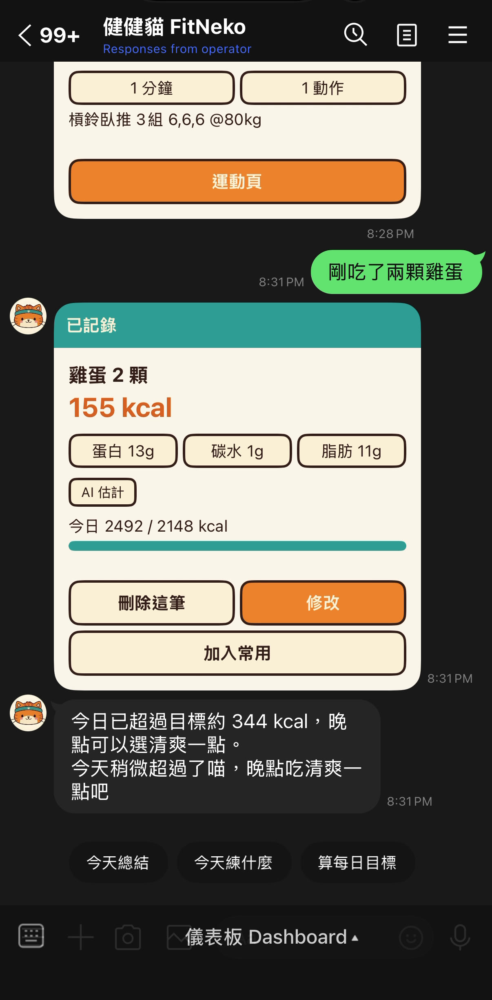
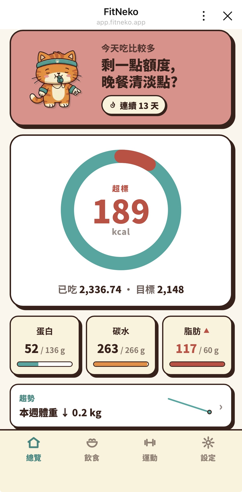
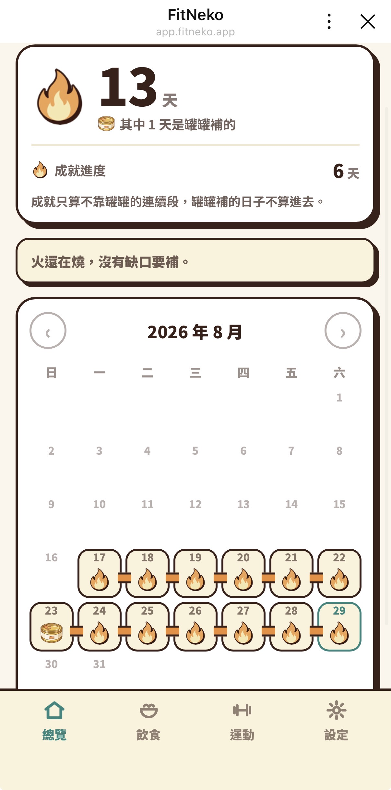
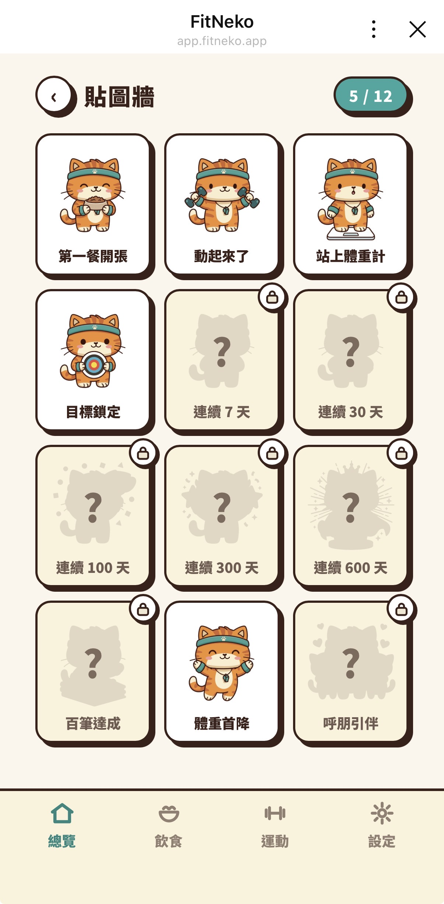
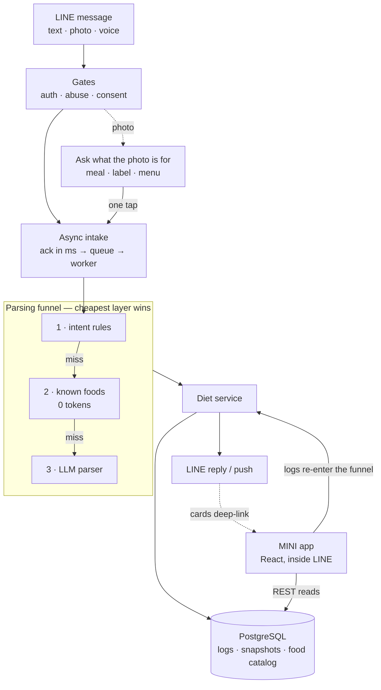

# FitNeko — Engineering Case Study

FitNeko is a LINE-first AI fitness coach, built solo: chat naturally — Chinese, English, or photos — to log meals and workouts; a React MINI app inside LINE handles the review-heavy rest.

**Live:** [fitneko.app](https://fitneko.app) — the bot, the MINI app, and the marketing site are all in production.

> 🚧 **Living case study of an actively developed product.** The source is private; this repo documents the architecture and the decisions. Details live in the [devlog](devlog/) and [deep dives](#deep-dives).

```
User: 早餐吃了一個鮭魚御飯團跟大杯拿鐵
Bot:  已記錄 🍙 鮭魚御飯團 ×1 (220 kcal) ☕ 大杯拿鐵 ×1 (180 kcal)
      今日累計 400 / 1800 kcal，蛋白質 18 / 120 g
```

## See it

<p align="center">
  
  
  
  
</p>

<sub>Log it in chat; review it in the MINI app — one LINE identity across both. More captures, each captioned with the engineering behind it, plus a 16-second clip of the whole loop, in **[demo/](demo/)**.</sub>

## What it does

**Log by talking.**
- Free-form zh-TW / English / mixed text becomes structured calorie + macro logs.
- Send a photo and the bot asks what it's for — meal, nutrition label, or menu — before spending anything.
- Voice notes feed the same parser; corrections are plain language — 「把早餐的蛋改成兩顆」 edits the entry it names.

**Know the food.**
- A 3,200+ item Taiwan food catalog — government nutrition data plus major chains' official figures — where an exact hit always beats an LLM guess.
- Hand-shaken drinks costed deterministically from eight chains' official figures: brand × base × sugar × toppings × cup size.
- Known and saved foods resolve with **zero LLM tokens**; the model only sees genuinely new input.

**Coach, not just count.**
- TDEE-assisted goals, MET-based workout logging, guided strength sessions (`10x70` logs a set), and six curated training programs applied in one tap.
- A cat coach that remembers your targets and recent conversation — one-liners after the numbers, never instead of them.
- Daily "what should I eat?" from the *remaining* budget; a weekly report card of stats + LLM commentary.
- Streaks pay out credits; a broken streak is repairable with credits — visibly marked, never counted by achievements.
- Inviting a friend rewards both sides, capped monthly so a leaked code isn't worth farming; milestone stickers at 3, 5, 10 and 30 friends keep the loop going past the cap.

**Built like a product.**
- The MINI app covers what chat is bad at: dashboard, editable history, trends, plans, search — bilingual.
- Every LLM and vision call is credit-gated, confirmed before spending, and ledgered.
- Abuse is priced out: a webhook rate guardrail, daily LLM quotas (a fair-use ceiling even when paid), anomaly rules in the daily ops digest.
- Consent gates both front doors before any data is collected; deletion, export and an anti-refarm tombstone make leaving a supported path.
- A paid tier on a hosted checkout, granted by a signature-verified idempotent callback; a free tier with published limits and a 30-day history window.
- A bilingual zero-build marketing site on `fitneko.app`; operations fit one person — a daily LINE digest, alarms pushed into the same channel, one kill switch, and an audited support CLI for refunds, credit adjustments and manual PASS grants.

## System at a glance


```mermaid
%%{init: {"themeVariables": {"fontSize": "18px"}}}%%
flowchart TD
    LINE[LINE message<br/>text · photo · voice] --> GATE[Gates<br/>auth · abuse · consent]
    GATE --> IN[Async intake<br/>ack in ms → queue → worker]
    GATE -. photo .-> ASK["Ask what the photo is for<br/>meal · label · menu"]
    ASK -- "one tap" --> IN
    IN --> RP

    subgraph FUNNEL [Parsing funnel — cheapest layer wins]
        direction TB
        RP["1 · intent rules"] -- miss --> KF["2 · known foods<br/>0 tokens"] -- miss --> LLM["3 · LLM parser"]
    end

    FUNNEL --> SVC[Diet service]
    SVC --> PG[(PostgreSQL<br/>logs · snapshots · food catalog)]
    SVC --> REPLY[LINE reply / push]
    REPLY -. cards deep-link .-> LIFF[MINI app<br/>React, inside LINE]
    LIFF -- REST reads --> PG
    LIFF -- "logs re-enter the funnel" --> SVC
```

<sub>Whichever layer resolves first wins — only genuinely new input reaches the LLM. The free-tier quota check sits *between* layers 2 and 3, so an over-quota user still logs anything the catalog already knows. Full detail in the [deep dives](#deep-dives).</sub>

**Stack:** Go · PostgreSQL / Neon · LINE Messaging API + LIFF · React + TypeScript + Vite · OpenAI + Anthropic APIs · AWS Lambda + SQS + API Gateway + CloudFront / Route 53 (Terraform) · DynamoDB · GitHub Actions CI/CD (OIDC, zero stored keys) · Playwright

**Scale:** ~41.8k LOC application Go · ~21.2k LOC TypeScript/React · ~60.4k LOC Go tests (255 files) · 64 migrations · 1,425 commits

## Deep dives

The interesting engineering lives in ten decisions:

| # | Deep dive | The one-line takeaway |
|---|-----------|----------------------|
| 1 | [Async intake: acknowledge fast, reply later](deep-dives/01-async-intake-pipeline.md) | LINE webhooks can't wait for an LLM — enqueue, return 200, treat the reply token as perishable. |
| 2 | [Deterministic parsing before the LLM](deep-dives/02-deterministic-parsing-before-llm.md) | 12 ordered rules resolve sure-fire intents with zero latency, zero cost, zero hallucination. |
| 3 | [One interface, two LLM providers](deep-dives/03-llm-provider-abstraction.md) | OpenAI and Anthropic force structure differently; unifying them shaped the parsing layer. |
| 4 | [Clarification flows: when the bot asks back](deep-dives/04-clarification-flows.md) | Multi-turn state in a stateless webhook world, TTL-bounded and gracefully degrading. |
| 5 | [Testing across a migration you haven't done yet](deep-dives/05-migration-proof-e2e.md) | One e2e suite ran unchanged before and after the serverless migration — guarding it, not rewritten by it. |
| 6 | [History is fact, a plan is a template](deep-dives/06-history-vs-template.md) | An autosave was silently erasing training history; the fix was classifying every row as fact or template. |
| 7 | [The cheapest LLM call is the one you never make](deep-dives/07-known-food-passthrough.md) | Known foods resolve before the model at zero cost, gated by a whitelist so a mis-read falls back instead of logging wrong data. |
| 8 | [The payment callback is a protocol, not a notification](deep-dives/08-payment-callback-protocol.md) | My HTTP response tells the provider whether to retry — so a permanent failure is acknowledged with success, and idempotency lives in the database, not in an `if`. |
| 9 | [Deletion has to defend against the person it just forgot](deep-dives/09-deletion-rights-vs-abuse.md) | Erasure destroys the evidence a defence would need, so the deletion flow and the anti-farming tombstone are one design. |
| 10 | [Consent is a gate, not a feature](deep-dives/10-consent-as-a-gate.md) | One consent record has to gate two front doors, the whole API, and jobs with no user present — so it's a middleware and an ordering constraint, not a screen. |

## Engineering practices

- **Spec-first phases** — every phase starts from a written spec with numbered requirements and explicit error cases (~26 phases so far).
- **TDD against behavior** — tests assert on replies sent and rows written, never internals; the one-command e2e harness survived the serverless migration unchanged.
- **CI on every push** — Go + web suites, e2e, Lambda smoke builds, terraform validate, a backup-restore proof; ~3 minutes, zero real credentials.
- **Checks the tests can't do** — lint, call-path vulnerability scanning and workflow linting gate every merge; dependency updates land weekly, security fixes immediately.
- **CD with zero stored keys** — every merge auto-deploys dev via GitHub OIDC, pinned to the commit CI passed; prod is a deliberate plan-then-apply.
- **Migrations as code** — versioned up/down SQL pairs, applied idempotently by the pipeline.
- **Graceful degradation by default** — LLM retries with backoff, clarification failures re-prompt, unreadable images never fabricate a log.

## Devlog

One entry per completed phase — problem, decisions, honest hindsight: **[devlog/](devlog/)**

## What this repo is not

Not the product source, not runnable. Prompt designs, full intent-rule conditions, and nutrition estimation rules stay private; code excerpts are architecture-level.

---

*ZihYong (Jeffery) Huang — [github.com/jeffery12697](https://github.com/jeffery12697)*
