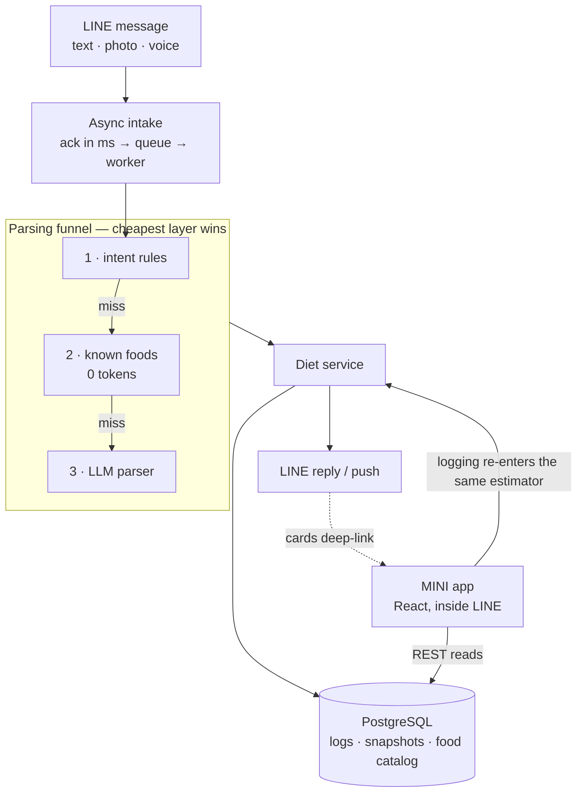

# FitNeko — Engineering Case Study

FitNeko is a LINE-first AI fitness coach, built solo: chat naturally — Chinese, English, or photos — to log meals and workouts; a React MINI app inside LINE handles the review-heavy rest.

> 🚧 **Living case study of an actively developed product.** The source is private; this repo documents the architecture and the decisions. Details live in the [devlog](devlog/) and [deep dives](#deep-dives).

```
User: 早餐吃了一個鮭魚御飯團跟大杯拿鐵
Bot:  已記錄 🍙 鮭魚御飯團 ×1 (220 kcal) ☕ 大杯拿鐵 ×1 (180 kcal)
      今日累計 400 / 1800 kcal，蛋白質 18 / 120 g
```

## What it does

**Log by talking.**
- Free-form zh-TW / English / mixed text becomes structured calorie + macro logs.
- Meal photos get portion estimates; nutrition labels get OCR'd, then the bot asks how much you ate.
- Voice messages are transcribed (Whisper) and flow through the same parser as text.
- Corrections in plain language — `把早餐的蛋改成兩顆`, `delete the latte from lunch` — against any past entry.

**Know the food.**
- A 2,500+ item Taiwan food catalog with source-tracked official nutrition; an exact hit always beats an LLM guess, and store-brand prefixes (`全家…`, `7-11…`) are parsed away before matching.
- Hand-shaken drinks decomposed — brand × base × sugar × toppings × cup size — costed by a deterministic engine over six tea chains' official figures, with each chain's own sugar ladder, cup sizes, topping menu and vocabulary curated per brand.
- Common foods, your saved foods, and your past corrections resolve with **zero LLM tokens**; the model is spent only on genuinely new input.

**Coach, not just count.**
- TDEE-assisted goals, MET-based workout logging, guided strength sessions (`10x70` logs a set).
- A cat coach with a voice: context-picked one-liners appended after the numbers, never replacing them — and a memory of your targets, latest weight, and the last 30 minutes of conversation.
- Daily "what should I eat?" answers from your *remaining* budget; a weekly report card — deterministic stats + LLM commentary that never restates them — with a full page and history in the MINI app, pushed every Monday for premium.
- Streaks and achievements pay out credits and unlock a collectible sticker wall: unlocked stickers animate when tapped, locked ones hide behind a silhouette and a "?".

**Built like a product.**
- The MINI app covers what chat is bad at — dashboard, editable history, trends, training-plan editor, and a search box over the food and drink catalogs where a drink's size, sweetness and toppings are dialed in by tapping — bilingual, same LINE identity.
- Cost guardrails on every LLM and vision call: earned credits, confirm-before-spend, every movement ledgered.
- A paid tier you can actually buy: pick a month / season / year card in the MINI app, pay on a hosted checkout (no card data on my infrastructure), and access is extended by a signature-verified callback that is idempotent on the order number and stacks onto whatever time is left. Expiry reminders are pushed before it lapses.
- The free tier is a defined product, not an unbounded one: text logging, saved foods and training plans have published limits; voice, photo recognition and the coaching features are what the pass unlocks. Over-quota never blocks a recording the catalog can already resolve.

## System at a glance


```mermaid
%%{init: {"themeVariables": {"fontSize": "18px"}}}%%
flowchart TD
    LINE[LINE message<br/>text · photo · voice] --> IN[Async intake<br/>ack in ms → queue → worker]
    IN --> RP

    subgraph FUNNEL [Parsing funnel — cheapest layer wins]
        direction TB
        RP["1 · intent rules"] -- miss --> KF["2 · known foods<br/>0 tokens"] -- miss --> LLM["3 · LLM parser"]
    end

    FUNNEL --> SVC[Diet service]
    SVC --> PG[(PostgreSQL<br/>logs · snapshots · food catalog)]
    SVC --> REPLY[LINE reply / push]
    REPLY -. cards deep-link .-> LIFF[MINI app<br/>React, inside LINE]
    LIFF -- REST reads --> PG
    LIFF -- "logging re-enters the same estimator" --> SVC
```

<sub>Whichever layer resolves first hands off to the service; only genuinely new input reaches the LLM. Photos go through Vision and voice through Whisper into the same funnel; a Monday scheduler feeds the same queue for weekly-report pushes; multi-turn clarifications park in DynamoDB with a TTL. The free-tier quota check sits *between* layers 2 and 3 — an over-quota free user still logs anything the catalog already knows, and only genuinely new input asks them to upgrade. Buying a pass leaves for a hosted checkout and comes back as a signed server-to-server callback that extends access in one transaction; orders and usage counters live in the same database. Full detail in the [deep dives](#deep-dives).</sub>

**Stack:** Go · PostgreSQL / Neon · LINE Messaging API + LIFF · React + TypeScript + Vite · OpenAI + Anthropic APIs · AWS Lambda + SQS + API Gateway (Terraform) · DynamoDB · GitHub Actions CI/CD (OIDC, zero stored keys) · Playwright

**Scale:** ~33.4k LOC application Go · ~12.6k LOC TypeScript/React · ~41.3k LOC Go tests (204 files) · 49 migrations · 855 commits

## Deep dives

The interesting engineering lives in seven decisions:

| # | Deep dive | The one-line takeaway |
|---|-----------|----------------------|
| 1 | [Async intake: acknowledge fast, reply later](deep-dives/01-async-intake-pipeline.md) | LINE webhooks can't wait for an LLM — enqueue, return 200, treat the reply token as perishable. |
| 2 | [Deterministic parsing before the LLM](deep-dives/02-deterministic-parsing-before-llm.md) | 12 ordered rules resolve sure-fire intents with zero latency, zero cost, zero hallucination. |
| 3 | [One interface, two LLM providers](deep-dives/03-llm-provider-abstraction.md) | OpenAI and Anthropic force structure differently; unifying them shaped the parsing layer. |
| 4 | [Clarification flows: when the bot asks back](deep-dives/04-clarification-flows.md) | Multi-turn state in a stateless webhook world, TTL-bounded and gracefully degrading. |
| 5 | [Testing across a migration you haven't done yet](deep-dives/05-migration-proof-e2e.md) | One e2e suite ran unchanged before and after the serverless migration — guarding it, not rewritten by it. |
| 6 | [History is fact, a plan is a template](deep-dives/06-history-vs-template.md) | An autosave was silently erasing training history; the fix was classifying every row as fact or template. |
| 7 | [The cheapest LLM call is the one you never make](deep-dives/07-known-food-passthrough.md) | Known foods resolve before the model at zero cost, gated by a whitelist so a mis-read falls back instead of logging wrong data. |

## Engineering practices

- **Spec-first phases** — every phase starts from a written spec with numbered requirements and explicit error cases (~26 phases so far).
- **TDD against behavior** — tests assert on replies sent and rows written, never internals; a one-command e2e harness (deterministic mock tier + LLM-judged real tier) survived the serverless migration unchanged.
- **CI on every push** — Go + web suites, mock-tier e2e, Lambda smoke builds, Playwright browser e2e, terraform validate, and a backup-restore proof; ~3 minutes, zero real credentials, and jobs are skipped when a change can't affect them.
- **Checks the tests can't do** — linter, call-path vulnerability scanning and workflow linting gate every merge; grouped dependency updates land weekly, security fixes immediately. Deploys are gated on CI passing, pinned to the exact commit that passed.
- **CD with zero stored keys** — every merge auto-deploys a dev environment via GitHub OIDC; prod is a two-step plan-then-apply, every deploy tagged.
- **Migrations as code** — versioned up/down SQL pairs, applied idempotently by the pipeline.
- **Graceful degradation by default** — LLM retries with backoff, clarification failures re-prompt, unreadable images never fabricate a log.

## Devlog

One entry per completed phase — problem, decisions, honest hindsight: **[devlog/](devlog/)**

## What this repo is not

Not the product source, not runnable. Prompt designs, full intent-rule conditions, and nutrition estimation rules stay private; code excerpts are architecture-level.

---

*ZihYong (Jeffery) Huang — [github.com/jeffery12697](https://github.com/jeffery12697)*
