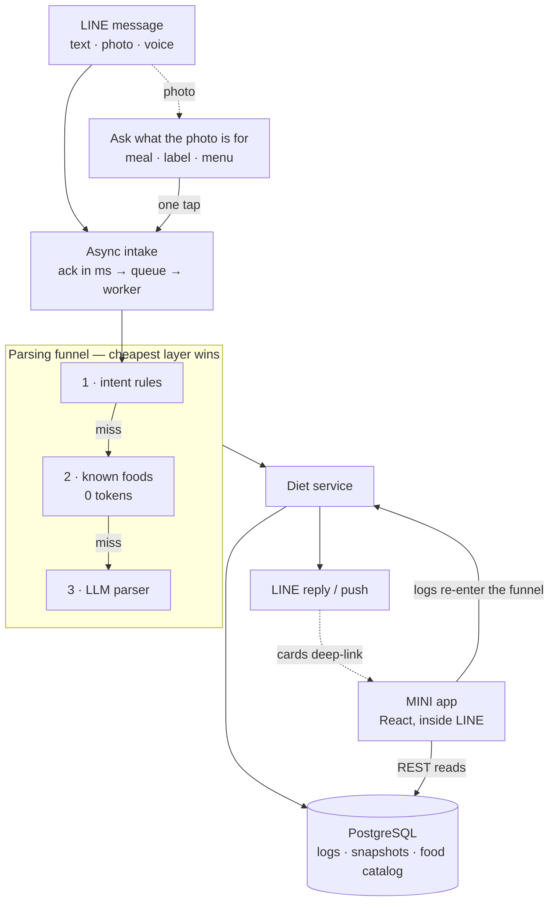

# FitNeko — Engineering Case Study

FitNeko is a LINE-first AI fitness coach, built solo: chat naturally — Chinese, English, or photos — to log meals and workouts; a React MINI app inside LINE handles the review-heavy rest.

> 🚧 **Living case study of an actively developed product.** The source is private; this repo documents the architecture and the decisions. Details live in the [devlog](devlog/) and [deep dives](#deep-dives).

```
User: 早餐吃了一個鮭魚御飯團跟大杯拿鐵
Bot:  已記錄 🍙 鮭魚御飯團 ×1 (220 kcal) ☕ 大杯拿鐵 ×1 (180 kcal)
      今日累計 400 / 1800 kcal，蛋白質 18 / 120 g
```

## What it does

**Log by talking.**
- Free-form zh-TW / English / mixed text becomes structured calorie + macro logs.
- Send a photo and the bot asks what it's for — meal, nutrition label, or menu — then runs that intent's own vision profile. Nothing is charged until you tap.
- Voice notes are transcribed (Whisper) into the same parser as text.
- Plain-language corrections against any past entry: `把早餐的蛋改成兩顆`, `delete the latte from lunch`.

**Know the food.**
- A 2,500+ item Taiwan food catalog with official nutrition; an exact hit always beats an LLM guess.
- Hand-shaken drinks decomposed — brand × base × sugar × toppings × cup size — costed deterministically from six tea chains' official figures.
- Known foods, saved foods and past corrections resolve with **zero LLM tokens**; the model is spent only on genuinely new input.

**Coach, not just count.**
- TDEE-assisted goals, MET-based workout logging, guided strength sessions (`10x70` logs a set).
- A cat coach that remembers your targets, latest weight and recent conversation — one-liners appended after the numbers, never replacing them.
- Daily "what should I eat?" from your *remaining* budget; a weekly report card of deterministic stats + LLM commentary that never restates them.
- Streaks and achievements pay out credits and unlock a collectible sticker wall.
- Invite a friend from the chat; both sides earn credits when the new user logs their first entry — capped monthly, so a leaked code isn't worth farming.

**Built like a product.**
- The MINI app covers what chat is bad at: dashboard, editable history, trends, plan editor, catalog search — bilingual, same LINE identity.
- Cost guardrails on every LLM and vision call: earned credits, confirm-before-spend, every movement ledgered.
- A paid tier you can actually buy: month / season / year cards on a hosted checkout, granted by a signature-verified, idempotent callback that stacks onto remaining time.
- The free tier is a defined product: published limits, a 30-day history window (nothing deleted — upgrading reveals it all), and over-quota never blocks what the catalog can already resolve.
- Leaving is a supported path: self-service account deletion (payments retained de-identified), full data export on request, and a hash-only tombstone so delete-and-rejoin can't re-farm one-time rewards.
- A bilingual, zero-build-step marketing site on the self-owned `fitneko.app` domain — product, pricing, terms and refund pages, held by a contract test that fails when the two languages drift.

## System at a glance


```mermaid
%%{init: {"themeVariables": {"fontSize": "18px"}}}%%
flowchart TD
    LINE[LINE message<br/>text · photo · voice] --> IN[Async intake<br/>ack in ms → queue → worker]
    LINE -. photo .-> ASK["Ask what the photo is for<br/>meal · label · menu"]
    ASK -- "one tap" --> IN
    IN --> RP

    subgraph FUNNEL [Parsing funnel — cheapest layer wins]
        direction TB
        RP["1 · intent rules"] -- miss --> KF["2 · known foods<br/>0 tokens"] -- miss --> LLM["3 · LLM parser"]
    end

    FUNNEL --> SVC[Diet service]
    SVC --> PG[(PostgreSQL<br/>logs · snapshots · food catalog)]
    SVC --> REPLY[LINE reply / push]
    REPLY -. cards deep-link .-> LIFF[MINI app<br/>React, inside LINE]
    LIFF -- REST reads --> PG
    LIFF -- "logs re-enter the funnel" --> SVC
```

<sub>Whichever layer resolves first hands off to the service; only genuinely new input reaches the LLM. The free-tier quota check sits *between* layers 2 and 3, so an over-quota user still logs anything the catalog already knows — and history reads are clamped to the free-tier window at the API, so every lock the app draws reports a server decision. Full detail in the [deep dives](#deep-dives).</sub>

**Stack:** Go · PostgreSQL / Neon · LINE Messaging API + LIFF · React + TypeScript + Vite · OpenAI + Anthropic APIs · AWS Lambda + SQS + API Gateway + CloudFront / Route 53 (Terraform) · DynamoDB · GitHub Actions CI/CD (OIDC, zero stored keys) · Playwright

**Scale:** ~37.0k LOC application Go · ~15.7k LOC TypeScript/React · ~50.9k LOC Go tests (225 files) · 54 migrations · 1,101 commits

## Deep dives

The interesting engineering lives in nine decisions:

| # | Deep dive | The one-line takeaway |
|---|-----------|----------------------|
| 1 | [Async intake: acknowledge fast, reply later](deep-dives/01-async-intake-pipeline.md) | LINE webhooks can't wait for an LLM — enqueue, return 200, treat the reply token as perishable. |
| 2 | [Deterministic parsing before the LLM](deep-dives/02-deterministic-parsing-before-llm.md) | 12 ordered rules resolve sure-fire intents with zero latency, zero cost, zero hallucination. |
| 3 | [One interface, two LLM providers](deep-dives/03-llm-provider-abstraction.md) | OpenAI and Anthropic force structure differently; unifying them shaped the parsing layer. |
| 4 | [Clarification flows: when the bot asks back](deep-dives/04-clarification-flows.md) | Multi-turn state in a stateless webhook world, TTL-bounded and gracefully degrading. |
| 5 | [Testing across a migration you haven't done yet](deep-dives/05-migration-proof-e2e.md) | One e2e suite ran unchanged before and after the serverless migration — guarding it, not rewritten by it. |
| 6 | [History is fact, a plan is a template](deep-dives/06-history-vs-template.md) | An autosave was silently erasing training history; the fix was classifying every row as fact or template. |
| 7 | [The cheapest LLM call is the one you never make](deep-dives/07-known-food-passthrough.md) | Known foods resolve before the model at zero cost, gated by a whitelist so a mis-read falls back instead of logging wrong data. |
| 8 | [The payment callback is a protocol, not a notification](deep-dives/08-payment-callback-protocol.md) | My HTTP response tells the provider whether to retry — so a permanent failure is acknowledged with success, and idempotency lives in the database, not in an `if`. |
| 9 | [Deletion has to defend against the person it just forgot](deep-dives/09-deletion-rights-vs-abuse.md) | Erasure destroys the evidence a defence would need, so the deletion flow and the anti-farming tombstone are one design. |

## Engineering practices

- **Spec-first phases** — every phase starts from a written spec with numbered requirements and explicit error cases (~26 phases so far).
- **TDD against behavior** — tests assert on replies sent and rows written, never internals; the one-command e2e harness survived the serverless migration unchanged.
- **CI on every push** — Go + web suites, e2e, Lambda smoke builds, terraform validate, a backup-restore proof; ~3 minutes, zero real credentials.
- **Checks the tests can't do** — lint, call-path vulnerability scanning and workflow linting gate every merge; dependency updates land weekly, security fixes immediately.
- **CD with zero stored keys** — every merge auto-deploys dev via GitHub OIDC, pinned to the commit CI passed; prod is a deliberate plan-then-apply.
- **Migrations as code** — versioned up/down SQL pairs, applied idempotently by the pipeline.
- **Graceful degradation by default** — LLM retries with backoff, clarification failures re-prompt, unreadable images never fabricate a log.

## Devlog

One entry per completed phase — problem, decisions, honest hindsight: **[devlog/](devlog/)**

## What this repo is not

Not the product source, not runnable. Prompt designs, full intent-rule conditions, and nutrition estimation rules stay private; code excerpts are architecture-level.

---

*ZihYong (Jeffery) Huang — [github.com/jeffery12697](https://github.com/jeffery12697)*
