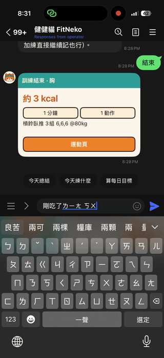
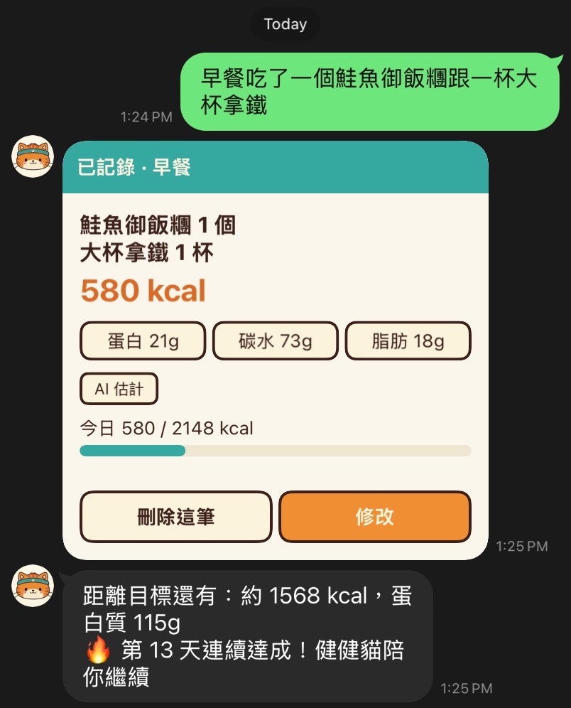
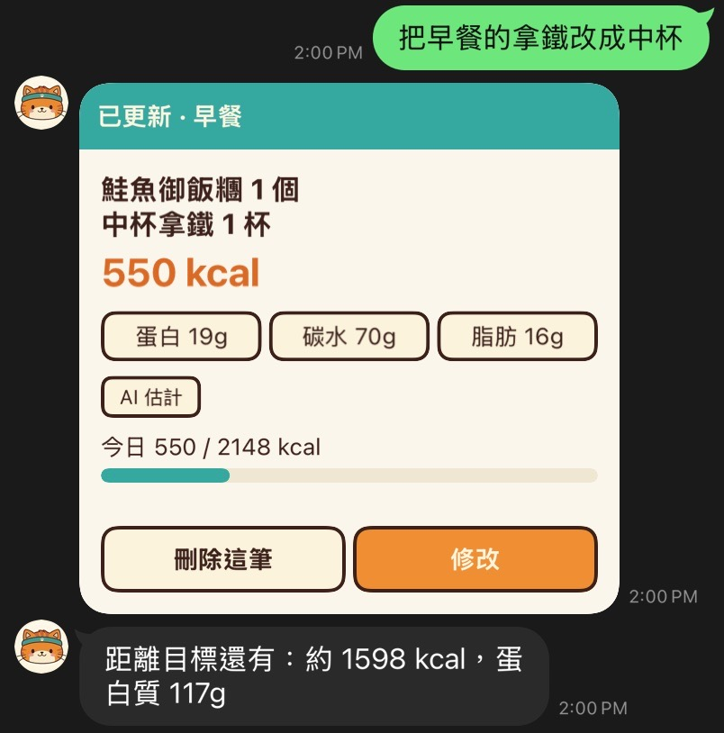
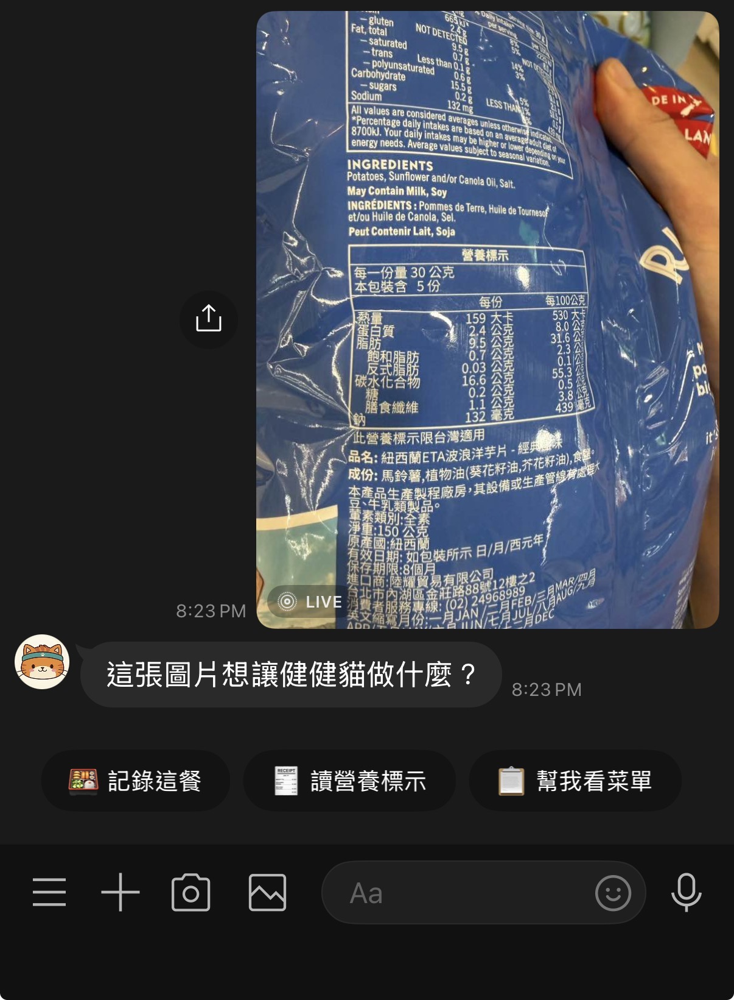
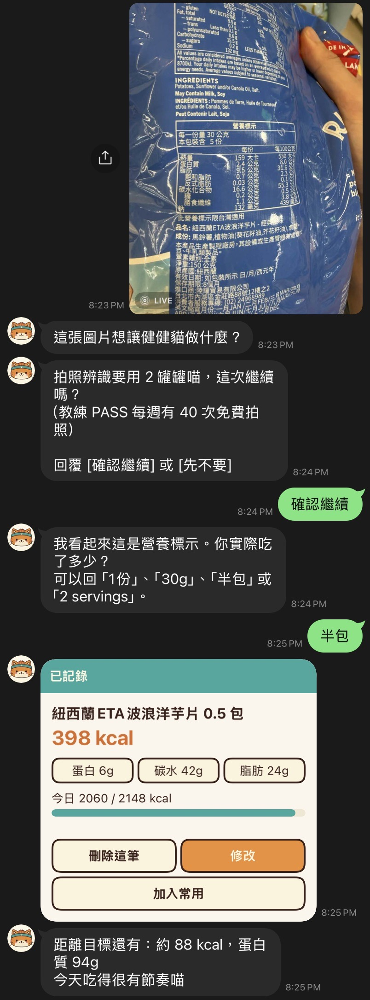
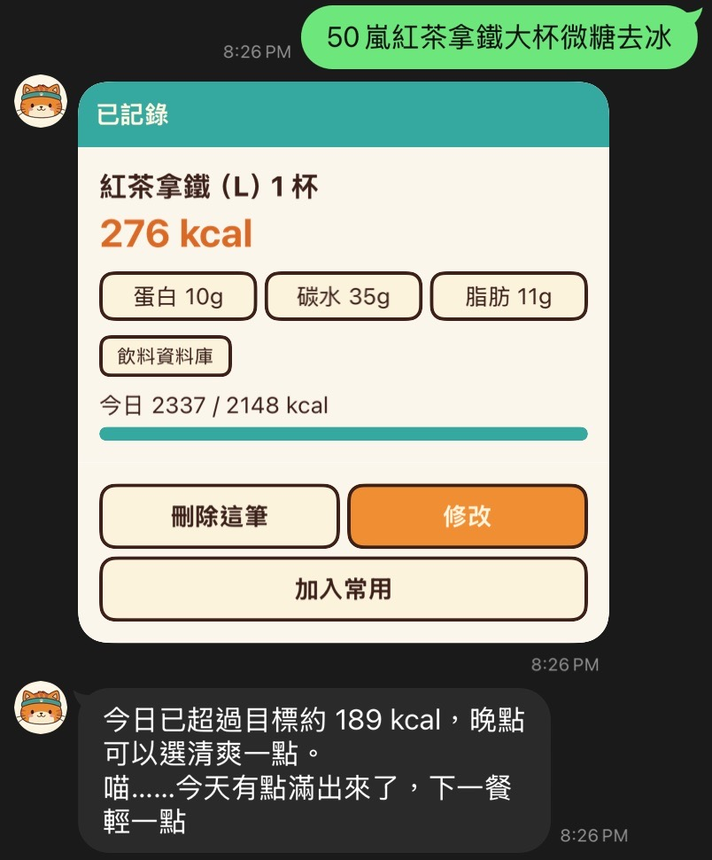
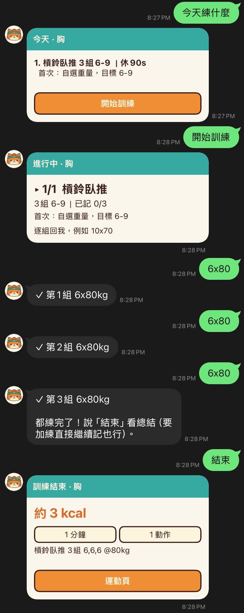
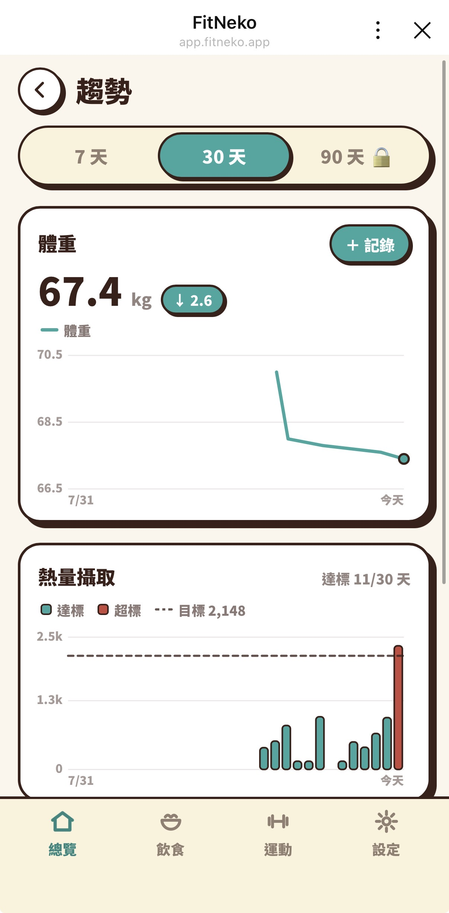
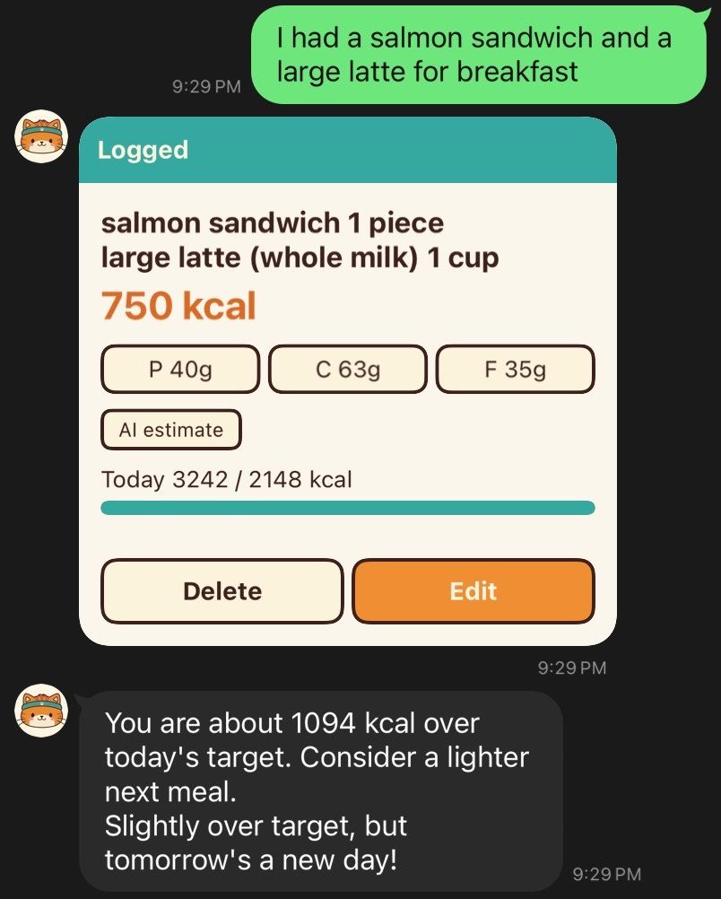
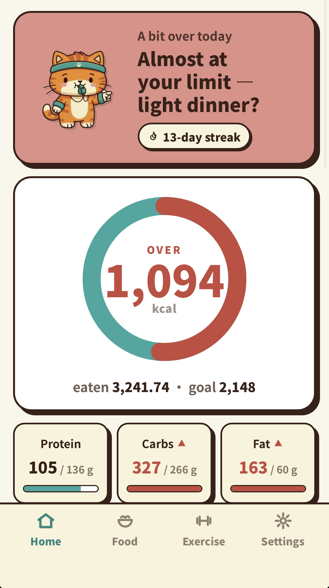

# Demo

Real captures from the shipped product — the LINE chat bot and the LIFF MINI app that opens inside it. Screenshots are from a real device and a real account (mine); the one place a display name appears, the hero clip's greeting, is pixelated.

Every caption names the engineering behind the pixels, with links into the [deep dives](../deep-dives/) and [devlog](../devlog/).

## The hero clip

**One identity, two surfaces.** Log two eggs in chat, tap the rich menu into the MINI app, and the dashboard already knows — same LINE identity end to end, no second login. The wait after sending is real (and sped up 5×): the webhook acked in milliseconds and a queue worker did the thinking → [deep dive #1](../deep-dives/01-async-intake-pipeline.md).

## Chat

| | |
|---|---|
|  | **Text in, structured log out.** 「早餐吃了一個鮭魚御飯團跟一杯大杯拿鐵」 becomes a two-item log with calories, macros, a running total against the personal target — and honest sourcing: the card says `AI 估計` when the numbers are a model's estimate. |
|  | **Targeted correction.** 「把早餐的拿鐵改成中杯」 edits the entry it names — the card flips to `已更新`, the size, calories and macros re-resolve, and the running total follows. |
|  | **The photo question.** Send a photo and the bot asks what it's for — log the meal, read the nutrition label, or scan the menu — instead of guessing and spending vision tokens on the wrong job → [devlog: asking the user what the photo is for](../devlog/2026-08-image-intent-routing.md). |
|  | **Label OCR, confirm-before-spend, then a scaled log.** The credit charge is confirmed first (nothing is billed until you say so), the label is read per-serving, the bot asks how much you actually ate, and 「半包」 logs half a bag at 398 kcal → [deep dive #4](../deep-dives/04-clarification-flows.md). |
|  | **The drink that isn't one number.** 「50嵐紅茶拿鐵大杯微糖去冰」 resolves brand × base × size × sugar × ice deterministically from the chain's official figures — the `飲料資料庫` badge (vs `AI 估計` above) tells you no model guessed → [devlog: the drink that isn't one number](../devlog/2026-07-phase-20c-bubble-tea-catalog.md). |
|  | **Mid-workout, a set is just `6x80`.** 「今天練什麼」 serves today's plan, each set is three keystrokes plus a weight, and 「結束」 closes with a summary card that deep-links into the MINI app's workout page. |

## LIFF MINI app

| | |
|---|---|
|  | **Dashboard in an honest state.** 189 kcal over target: the ring turns on you, the fat bar flags itself, and the state-driven Neko banner suggests a lighter dinner instead of pretending it's fine. |
|  | **The streak calendar keeps two books.** 13 days on display — one of them visibly bought back with credits (the canned-food day), and the achievement counter honestly says 6, because achievements never count repaired days → [devlog: selling streak repairs without selling streaks](../devlog/2026-08-phase-23-streak-repair.md). |
|  | **The sticker wall.** Achievements as collectibles — unlocked stickers in full art, locked ones as silhouettes with their condition stated. |
|  | **Trends, with the free tier's edge visible.** Weight and intake over 30 days, weight entry on the same screen — and the 90-day tab wears a lock, because history windowing is a server decision the UI merely reports → [devlog: phase 26](../devlog/2026-08-phase-26-account-data.md). |

## Bilingual

Language is a profile setting: flip it to English and the whole product follows.

| | |
|---|---|
|  | **Same pipeline, other language.** `I had a salmon sandwich and a large latte for breakfast` — the parser, the reply card and the coach's follow-up all speak the profile's language. |
|  | **The MINI app follows too.** The dashboard in English — the same over-target honesty, translated. |

## Capture notes

- Stills are device screenshots (chat in dark mode, MINI app in its own light theme); the hero clip is a screen recording cut to ~16s, with the send-to-reply wait time-lapsed 5× and the greeting's display name pixelated at the pixel level (downscale → upscale → blur, unrecoverable).
- No other frame contains a personal identifier: LINE shows no name or avatar on your own messages, and the bot's avatar is the mascot.
